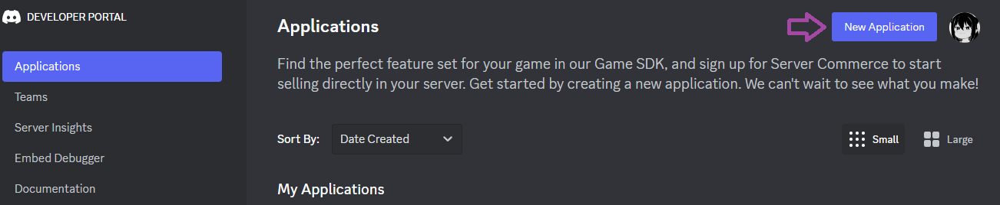
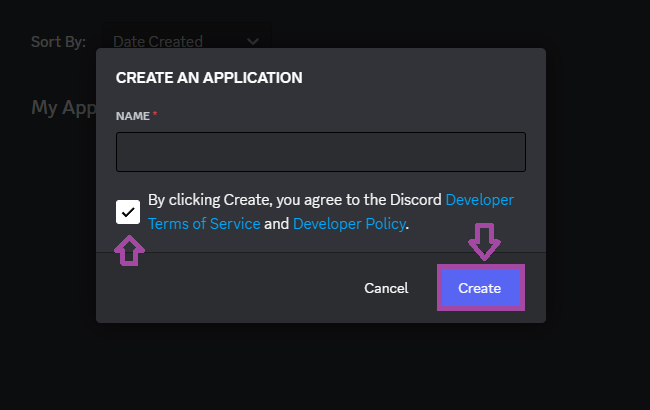
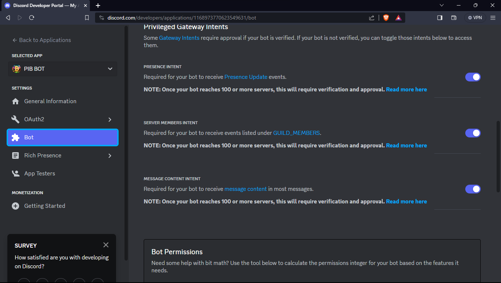

# Gladmc BOT
Um BOT para farmar AFK sem precisar abrir várias abas de Minecraft em seu computador.

<h4>Passo 1: Criar um BOT do Discord</h4>
Primeiro você precisa criar um BOT do Discord em <a href="https://discord.com/developers/applications">Discord Dev</a>

<h4>Passo 1.2: Criar o BOT</h4>





<h4>Passo 1.3: Você precisa ativar os intents de seu BOT</h4>



<h4>Passo 1.4: Você precisa gerar um token para seu BOT</h4>


<h4>Passo 1.5: Copie seu Token do seu BOT</h4>


<h4>Passo 2: Instalação </h4>
Agora, você precisa criar um grupo privado no discord e chamar seu BOT para o grupo que você criou. Crie uma sala com qualquer nome e copie o ID do chat. Para fazer isso, seu Discord precisa estar em modo de desenvolvedor. Caso não saiba como fazer isso, deixei um <a href="https://www.youtube.com/watch?v=EnobVSQ7gmQ&ab_channel=Hyouka">Tutorial em video</a>

<h4>Passo 2.1: Instalar Node.js</h4>
Instalar Node.js
Para proxima etapa você precisa instalar o <a href="https://nodejs.org/en">Node.js</a> e versão LTS

<h4>Passo 3 Configuração</h4>
Para começar, você precisa editar o arquivo config.json.exemple para config.json e abrir ele e configurar com os dados do seu bot.
<p>

```

{
    "token": " TOKEN COLE O TOKEN AQUI ",
    "channel": " channel "
}

```

<h4> Passo 4: Instalar módulos do Node.js </h4>
Para instalar os módulos do Node.js, você precisa clicar no arquivo Instalar.bat que está dentro da pasta.

<h4>Passo 5: Configurar suas contas</h4>

Edite o arquivo accounts.txt.exemple para accounts.txt

Abra o arquivo accounts.txt e configure suas contas

Conta original:
```
seunick:123:/pw suapw:microsoft
```

Conta pirata:
```
seunick:suasenha:/pw suapw:
```

<h4>Passo 6: Iniciar o bot <h4>
Para iniciar o bot, basta abrir o arquivo Start.bat. Você não precisa fazer mais nada após isso. As contas começarão a entrar no servidor.


